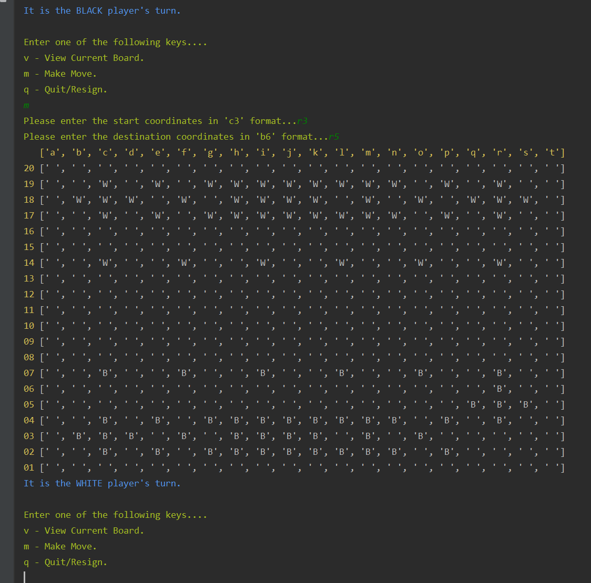

# Gess Game Project
{A python terminal playable 'Gess' game, a hybrid of Go/Chess}

Implementation of Gess, a GO/Chess hybrid game. The game is played on an 18x18 grid of squares, with each
player owning 43 stones, represented with "B" for the black stones and "W" for the white stones. "E" represents empty
spots but a method in the GessGame class be used to alter that to user's preference. Moves are made by declaring the
center of a 3x3 stone grid on the board and the center of the desired destination of that 3x3 grid, which is referred
to as a footprint. Players take turns declaring moves, starting with the Black player first.

Once the center piece of a footprint is declared, the class has access to the coordinates of all 9 squares that make
up the footprint. Each time a move is made, the move is checked for validity in terms of spaces moved, direction,
valid footprint, etc. Invalid moves return False, and print a message declaring the issue, while valid moves are executed
and then an updated board is displayed. Once a move is execured, the game checks if a player has won. A player
wins when the opposing player has no 'rings' or 'circles' of 8 stones all owned by the player, with an empty center.
Detailed rules can be found at https://www.chessvariants.com/crossover.dir/gess.html.

